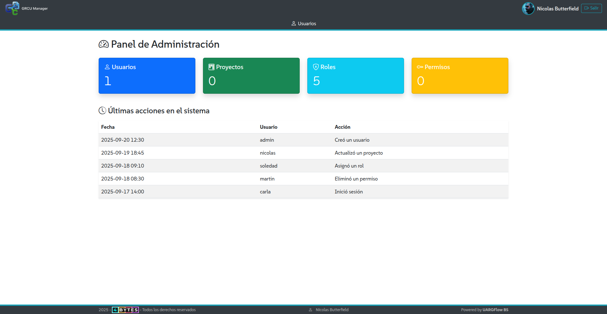
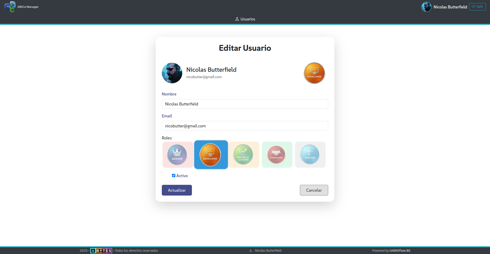

<p align="center">
  
</p>

# 📌 GRCU Manager – Gestor de Requerimientos y Casos de Uso  

📊 **Sistema académico desarrollado para la materia _Laboratorio de Desarrollo de Software_ (UNPA)**  
👥 **Team:** 4Bytes 

<p align="center">
  
</p>

---

## 📖 Descripción  

**GRCU Manager** es una aplicación web construida con **Django** que permite gestionar de forma ordenada los **requerimientos** y **casos de uso** de un proyecto de software.  

Su propósito principal es ofrecer a equipos de desarrollo una herramienta práctica para documentar, organizar y priorizar la información clave durante la etapa de análisis, manteniendo un historial de cambios y una **matriz de trazabilidad** completa.  

---

## ✨ Funcionalidades principales  

- ✅ Registrar y administrar requerimientos y casos de uso de software.  
- ✅ Asignar prioridades con la técnica **MoSCoW** (_Must, Should, Could, Won’t_).  
- ✅ Mantener historial de cambios y versiones en cada requerimiento.  
- ✅ Definir dependencias entre requerimientos.  
- ✅ Agrupar requerimientos mediante categorías o etiquetas.  
- ✅ Generar una **matriz de trazabilidad** que vincule requerimientos con casos de uso.  
- ✅ Añadir comentarios y discusiones.  
- ✅ Adjuntar documentos o enlaces externos.  
- ✅ Inspirado en funcionalidades de herramientas profesionales (con un enfoque académico).  

---

## 🖥 Capturas de pantalla  

> *(Aquí podés insertar screenshots relevantes del sistema en uso — ej. login, panel principal, matriz de trazabilidad, etc.)*  

<p align="center">
  
</p>  

<p align="center">
  
</p>  

---

## 🚀 Instalación  

1. Clonar el repositorio:  
   ```bash
   git clone https://github.com/usuario/grcu-manager.git
   cd grcu-manager
   ```
2. Configurar entorno virtual y dependencias:  
   ```bash
   pip install -r requirements.txt
   ```
3. Configurar la base de datos en `settings.py` y ejecutar migraciones:  
   ```bash
   python manage.py migrate
   ```
4. Iniciar el servidor:  
   ```bash
   python manage.py runserver
   ```
5. Acceder en el navegador:  
   ```
   http://localhost:8000
   ```

---

## 🛠 Tecnologías  

- **Frontend:** HTML, CSS, JavaScript  
- **Backend:** Django (Python)  
- **Base de datos:** PostgreSQL / MariaDB  
- **Control de versiones:** Git + GitHub  

---

## 🎯 Uso  

- Ingresar al panel de administración.  
- Crear, editar y eliminar requerimientos y casos de uso.  
- Asignar prioridades y categorías.  
- Visualizar la **matriz de trazabilidad**.  
- Comentar y adjuntar documentos.  

---

## 🛣 Roadmap  

- 🔐 Añadir autenticación de usuarios y gestión de roles (Leader, Developer, Stakeholder, Visitante).  
- 🕒 Implementar historial completo de cambios con notificaciones.  
- 📊 Exportar matriz de trazabilidad en PDF/Excel.  
- 🎨 Mejorar la interfaz con gráficos de progreso.  

---

## 🤝 Contribución  

1. Forkear el repositorio.  
2. Crear tu rama: `git checkout -b feature/nueva-funcionalidad`.  
3. Hacer commit: `git commit -m "Añadir nueva funcionalidad"`.  
4. Push a la rama: `git push origin feature/nueva-funcionalidad`.  
5. Abrir un Pull Request.  

---

## 👩‍💻 Equipo  

|  |  |  |  |
|:------------------------------:|:--------------------------:|:------------------------:|:--------------------------------:|
| **Martina Gagna**              | **Abril Alvarez**          | **Nicolás Butterfield**  | **Cristian Carranza**            |

**Dev Team: 4Bytes**  

---

## 📄 Licencia  

Este proyecto está bajo la licencia **MIT**.  

---

## 🔗 Links útiles  
 
- 💻 [Repositorio en GitHub](https://github.com/uarg-unpa/grcu-manager)  
